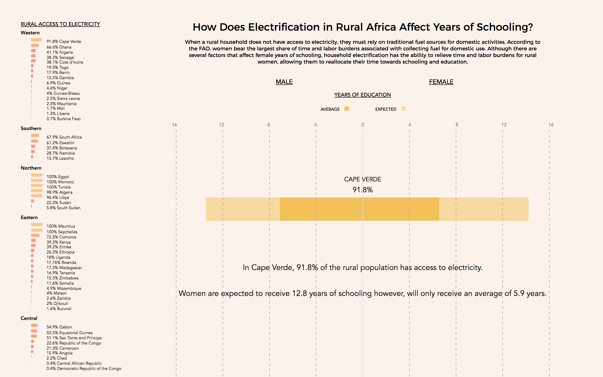

## How Does Electrification in Rural Africa Affect Years of Schooling?

### Description 

#### Using a gender lens, this visualization explores how access to electricity in rural Africa affects years of schooling. When a rural household does not have access to electricity, they must rely on traditional fuel sources for domestic activities. According to the FAO, women bear the largest share of time and labor burdens associated with collecting fuel for domestic use. While there are several factors that affect the amount of education female's receive, household electrification has the ability to relieve time and labor burdens for rural women, allowing them to reallocate their time towards schooling. 

### Image

